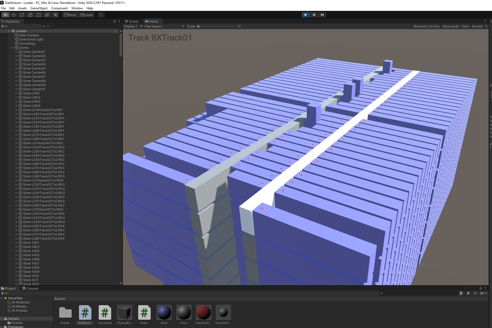

## How it works

The application monitors for changes to "./BenchSystem.config" (yes, relative to the current working directory) and renders some of the contents.

You can fly around with W, A, S, D, LCTRL, SPACE. LSHIFT accellerates you. ESC unlocks the mouse.

## Authoring details

Built with [Unity](https://unity.com/download) 2020.3.25f1 and Visual Studio 2022 on Windows 10 by [Mick van Gelderen](https://github.com/mickvangelderen).

